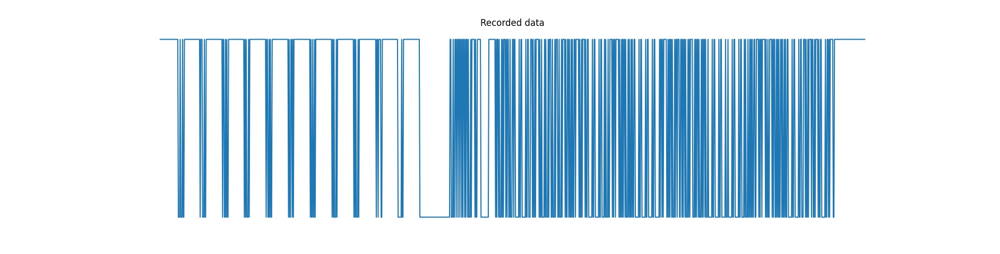

# ASCII UART

## Description
Un informateur a intercepté un message binaire transmis sur un câble. Il a rapidement enregistré via la carte son d'un PC les données en 8 bits signés (ascii_uart.raw). Dans la précipitation, il a oublié de noter la fréquence d'échantillonnage. Retrouvez le message.

## Solution
The goal was to read data from [ascii_uart.raw](./ascii_uart.raw). We know that the data was encoded with the [UART](https://en.wikipedia.org/wiki/Universal_asynchronous_receiver-transmitter) protocol on 8 bits. At first, we misread the description and thought the UART data was directly on the file. This is not the case. As stated in the description, data was recoreded using the sound card of a computer, so we have even raw-er data.

We can show this data with [show_uart.py](./show_uart.py) (Requires matplotlib)
```
$ python show_uart.py ascii_uart.raw
```
<p align="center">
    
</p>

We can clearly see that this data is made up of 0s and 1s. However, we still need to find the sampling frequency. But it is easily found by counting the minimum length of consecutive bit. We can then convert the data to the actual UART data. [convert.py](./convert.py) will do that for us.
```
$ python convert.py ascii_uart.raw uart
$ python show_uart.py uart
```
<p align="center">
    
</p>
It is now actual readable bits data.

Time for decoding. A UART message, in this context, is written like this:
```
...1 1 1 1 1 0 d0 d1 d2 d3 d4 d5 d6 d7 p? 1 1 1 1...
             |                         |
stop bits (1)|    8 bits LSB to MSB    |stop bits (1)
             |                         |
         start bit                 parity bit
        (must be 0)                (optional)
```
Our 8 bits of data are then translated to ASCII code. We can now use transform our stream of bits into a valid ASCII message. [flag.py](./flag.py) will do just that, reading the bit stream, checking for valid UART packets, and convert them into text. We still need to check for the parity bit. *`True` to check for it, `False` otherwise*
```
$ python flag.py False uart
ÿÿÿEÿYIEEÿ [}üué        Ñ¢¢eé^ySzYþ

$ python flag.py True uart
DGSESIEE{ d[-_-]b  \_(''/)_/  (^_-)   @}-;---    (*^_^*)  \o/ }
```

We can now collect the password and claim our 100 points.