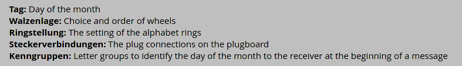

# L'énigme de la crypte

## Description

Une livraison de souffre doit avoir lieu 47°N 34 2°W 1 39.

Elle sera effectuée par un certain REJEWSKI. Il a reçu des instructions sur un foulard pour signaler à Evil Gouv son arrivée imminente.

Nous avons une photo du foulard, mais celle-ci n'est pas très nette et nous n'avons pas pu lire toutes les informations. Le fichier foulard.txt, est la retranscription du foulard.

Nous avons un peu avancé sur les parties illisibles :

(texte illisible 1) est deux lettres un espace deux lettres. Il pourrait y avoir un lien avec le dernier code d'accès que vous avez envoyé à Antoine Rossignol.

(texte illisible 2) a été totalement effacé et enfin (texte illisible 3) semble être deux lettres.

REJEWSKI vient d'envoyer un message (final.txt). Il faut que vous arriviez à le déchiffrer. Je vous conseille d'utiliser openssl pour RSA.

## Advancement
[foulard.txt](./foulard.txt) states that we should use a machine of type M3. Add the fact that the settings seemed to be German and we got a message encrypted using an [Enigma machine](https://en.wikipedia.org/wiki/Enigma_machine). Taken from [Enigma World Code Group](./https://www.enigmaworldcodegroup.com/how-to-create-an-enigma-message), it indicates what is what.

<p align="center">
    
</p>

We can deduce, from the description of the challenge, the use of each setting.
```
Walznlage: Odd ones in increasing order
Ringstellung : REJ
Steckerverbindungen : ?? ??
Grundstellung : MER
Kenngruppen: B??
```

Due to the lack of time, we did not went further. We know that to decipher the message, we need to crack the RSA key and brute force the rest of the settings.