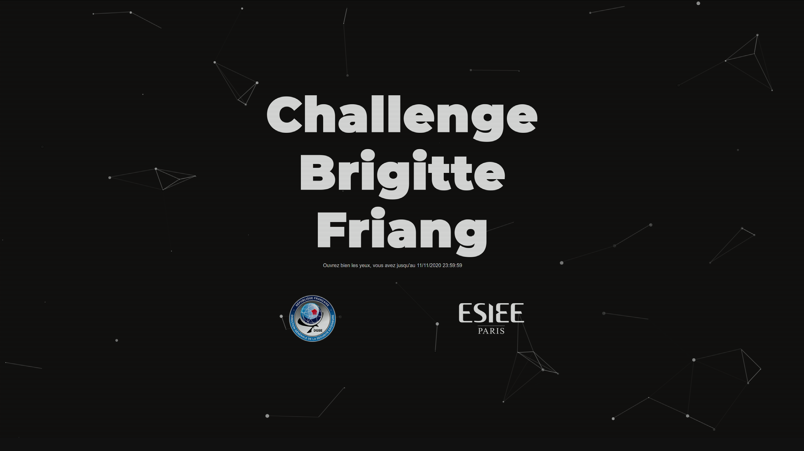

# Introduction

## Homepage

As stated in the main readme, the challenge was located at https://challengecybersec.fr/. This is how the page looked like the 11/11.

<p align="center">
    
</p>

As everyone can see, there is not a lot of information to work with. However, by checking the source of the page, something can be spotted in the `<head>`:
```html
<head>
    <meta charset="utf-8">
    <title>Challenge Brigitte Friang</title>
    <meta name="viewport" content="width=device-width, initial-scale=1.0" />
    <meta http-equiv="X-UA-Compatible" content="ie=edge" />
    <link rel="stylesheet" href="/static/bootstrap/css/bootstrap.min.css">
    <link rel="stylesheet" href="/static/css/style.css">
    <!--/static/message-secret.html-->
</head>
```

This comment gives us a new direction into a new problem: https://challengecybersec.fr/static/message-secret.html.

## Secret Message

This new link points to this new page with the title `Cesar`:

<p align="center">
    
</p>

From the title, one can understand that the message is encoded with the Caesar method. Cracking the key is pretty easy. The file [caesar_crack.py](./caesar_crack.py) prints the 26 possible Caesar keys with the decoded text.
```
$ python caesar_crack.py 
+0      - Zp cvbz whyclulg h spyl jl tlzzhnl, j'lza xbl cvbz wvbclg
...
+18     - Rh untr ozqudmdy z khqd bd ldrrzfd, b'drs ptd untr ontudy
+19     - Si vous parvenez a lire ce message, c'est que vous pouvez
+20     - Tj wpvt qbswfofa b mjsf df nfttbhf, d'ftu rvf wpvt qpvwfa
...
+25     - Yo buay vgxbktkf g roxk ik skyygmk, i'kyz wak buay vuabkf
$
```
The words at `+19` is the only readable french text, it's the key. This is the decoded text using this offset:
```
Si vous parvenez a lire ce message, c'est que vous pouvez rejoindre l’operation «Brigitte Friang». Rejoignez-nous rapidement.

Brigitte Friang est une resistante, journaliste et ecrivaine francaise. Elle est nee le 23/01/1924 a Paris, elle a 19 ans sous l'occupation lorsqu'elle est recrutee puis formee comme secretaire/chiffreuse par un agent du BCRA, Jean-Francois Clouet des Perruches alias Galilee chef du Bureau des operations aeriennes (BOA) de la Region M (Cote du Nord, Finistere, Indre et Loire, Orne, Sarthe, Loire inferieure, Maine et Loire, Morbihan, Vendee). Brigitte Friang utilise parfois des foulards pour cacher des codes. Completez l’URL avec l’information qui est cachee dans ce message.

Suite a l’arrestation et la trahison de Pierre Manuel, Brigitte Friang est arretee par la Gestapo. Elle est blessee par balle en tentant de s’enfuir et est conduite a l’Hopital de la Pitie. Des resistants tenteront de la liberer mais sans succes. Elle est torturee et ne donnera pas d'informations. N’oubliez pas la barre oblique. Elle est ensuite envoyee dans le camp de Ravensbruck.

Apres son retour de deportation, elle participe a la creation du Rassemblement du peuple franxais (RPF). Elle integre la petite equipe, autour d'Andre Malraux, qui va preparer le discours fondateur de Strasbourg en 1947 et les elections legislatives de 1951.

Elle rentre a l'ORTF, et devient correspondante de guerre. Elle obtient son brevet de saut en parachute et accompagne des commandos de parachutistes en operation durant la guerre d’Indochine. Elle raconte son experience dans Les Fleurs du ciel (1955). D'autres agents sont sur le coup au moment ou je vous parle. Les meilleurs d'entre vous se donneront rendez-vous a l'European Cyberweek a Rennes pour une remise de prix. Resolvez le plus d'epreuves avant la fin de cette mission et tentez de gagner votre place parmi l'elite! Par la suite, elle couvre l’expedition de Suez, la guerre des Six Jours et la guerre du Viet Nam. Elle prend position en faveur d'une autonomie du journalisme dans le service public ce qui lui vaut d'etre licenciee de l'ORTF.

Elle ecrit plusieurs livres et temoigne de l'engagement des femmes dans la Resistance.
```
Another thing that is spottable in the webpage are the fact that some characters are in bold. Separating these yields `/joha` and `/chat` after decoding. This is the link for the next part of the challenge, https://challengecybersec.fr/chat.