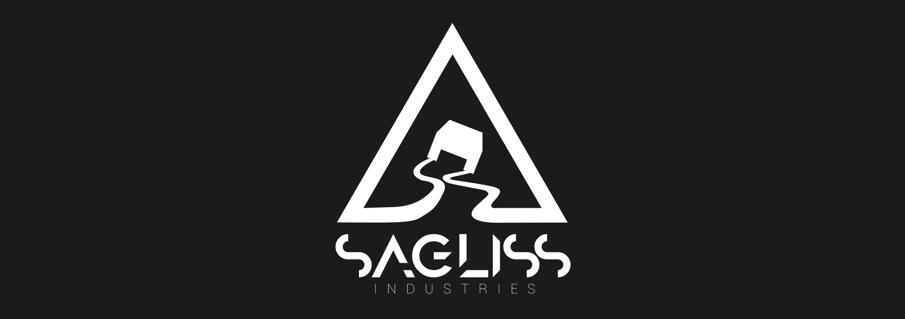

    

# 2020 Brigitte Friang Challenge: First-timers Write-up.
Presented by the 'Sagliss' team composed by:

- [Yohann "MrLag" Bosqued](https://github.com/MrLag31)
- [Célian "celianvdb" Van Der Biest](https://github.com/celianvdb)
- [astalios](https://github.com/Astalios)

This is a write-up from (mainly) three people inexperienced in CTFs and challenges (it was our first one). It will give you insights on our thinking, our tests, our failures and our successes from a begginner's team point of view.

## The Challenge
It was hosted by the DGSE and ESIEE Paris on https://challengecybersec.fr/ and lasted from 24/10/2020 to 11/11/2020. The challenge was themed around [Brigitte Friang](https://en.wikipedia.org/wiki/Brigitte_Friang), who was part of the french resistance, and the goal was to retrieve scattered informations from agents about an evil corporation named "Evil Country". It was separated into three main parts:

- __[Introduction](./Brigitte%20Friang%20Challenge/Introduction)__: Some preliminaries before entering the actual challenge.
- __[The Chat](./Brigitte%20Friang%20Challenge/Chat)__: The first part containing different categories of challenges.
- __[Coros CTF](./Brigitte%20Friang%20Challenge/Coros%20CTF)__: The actual CTF challenges.

## More Details
The challenge was first started by [astalios](https://github.com/Astalios) the 06/11, pretty late into the CTF. He quickly asked help from [MrLag](https://github.com/MrLag31) and [celianvdb](https://github.com/celianvdb) and formed a team to work on the challenge. We mostly worked during the 3 following days. We were able to quickly get to the chat the first day, entered Coros CTF at the end of the second day and, finally, finished 5 challenges during the rest of our time.